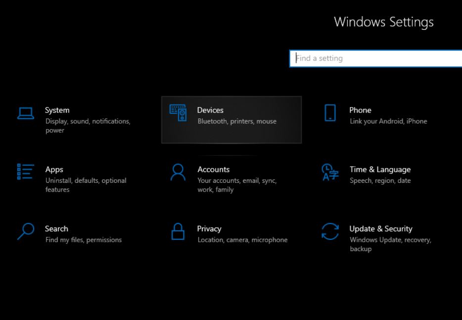
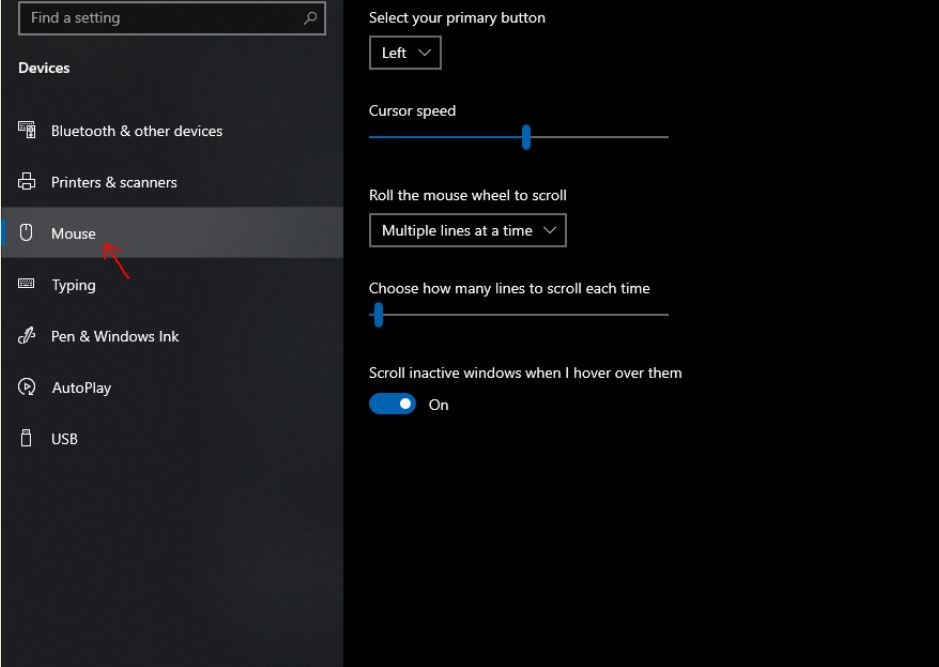
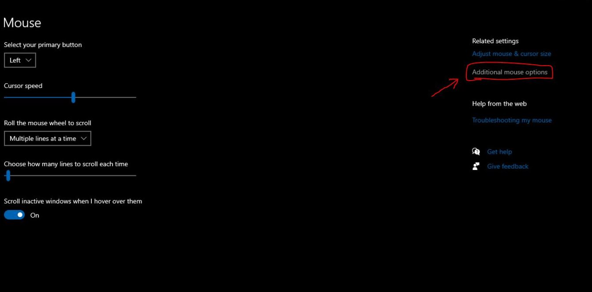
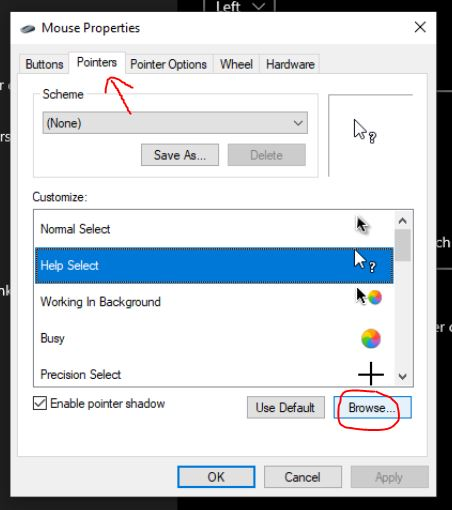
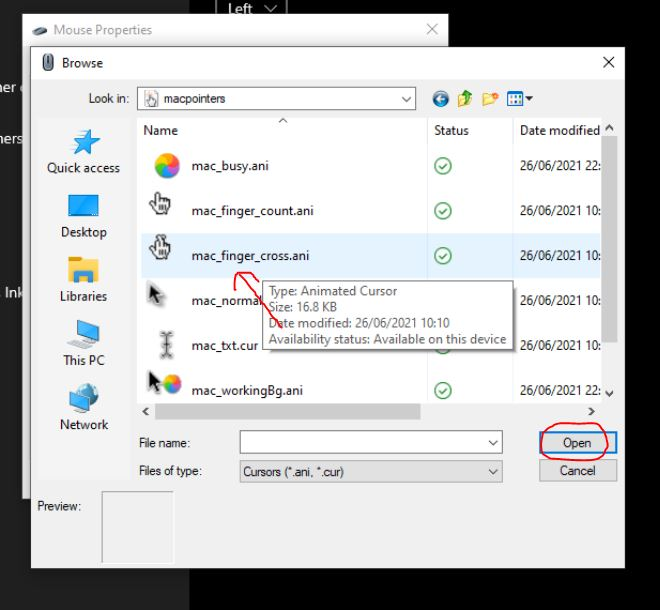

# MAC-Pointers 
<b>By Arka Saha, TECH STOP </b>
  
### 1. First, Download And Extract The Mac-Pointers From This ZIP File. <i>Keep The  MAC Pointers In A New Folder!</i>
### 2. Open Settings > Devices
   
### 3. Click On Mouse to Open The Mouse Settings Tab
   
### 4. Click On Additional Mouse Options
   
### 5. Go To The Pointers Tab > Choose The Pointer To Customize > Press Browse
   
### 6. Choose The Pointer > Open > Apply > OK.
   
